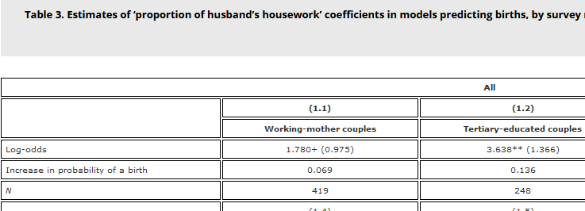
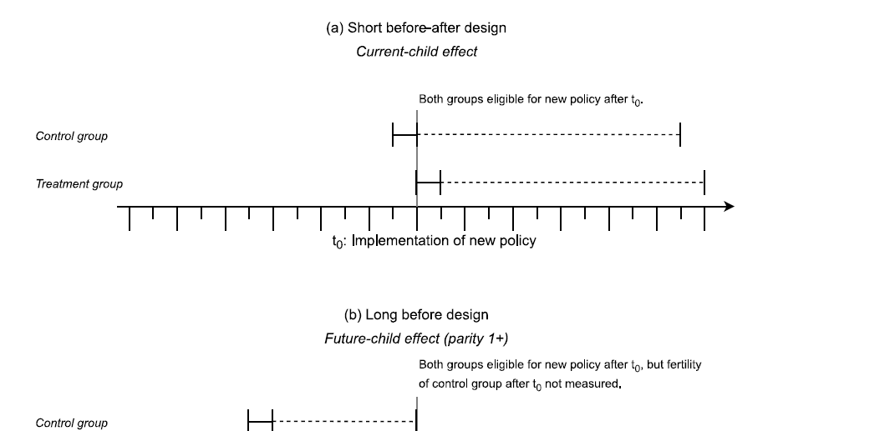
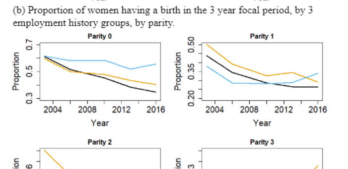
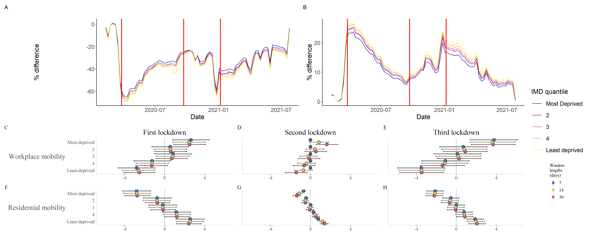
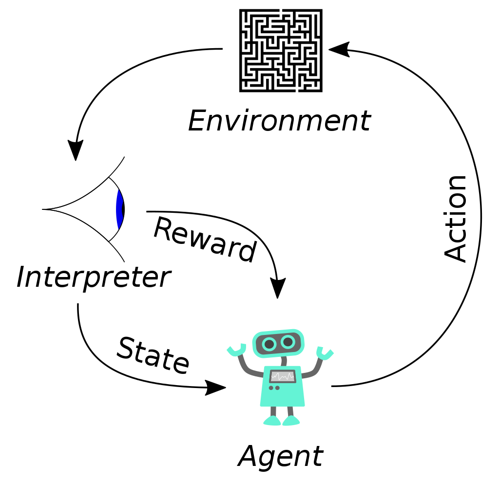
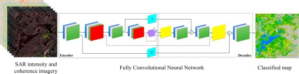
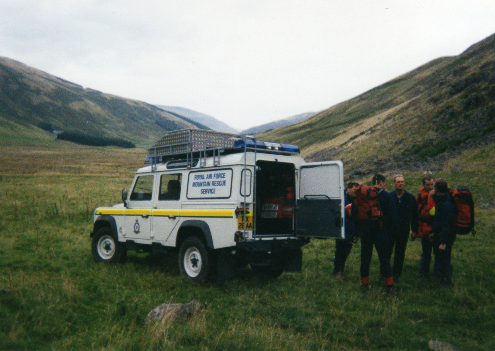

## Project Portfolio

---

### Impact of housework sharing on fertility in Taiwan

Predicted future births using husbands’ share of housework and other covariates. Used logistic regression models on longitudinal social survey data. First quantitative evidence that housework impacts fertility in Taiwan. Code [here](https://github.com/jacacthomas/houseworkFertilityTaiwan), published in Asian Population Studies [here](https://doi.org/10.1080/17441730.2022.2035555).

### Systematic review of effect of parental leave on fertility

Reviewed and synthesised all published studies on the impact of leave on fertility. Developed a new conceptual scheme for identifying causal impacts in quasi-experimental studies, and demonstrated an overall impact for the first time. Published in Humanities and Social Science Communications [here](https://doi.org/10.1057/s41599-022-01270-w).

### Impact of parental leave on fertility in Taiwan

Evaluated the impact of a 2009 leave reform on fertility in Taiwan. Used difference-in-differences multilevel logistic regression modelling on survey data. Found no evidence of impact robust to alternative model specifications. First study to evaluate causal impact of leave on fertility in Asia. Code [here](https://github.com/jacacthomas/p3_rfiles).

### Effect of Covid-19 lockdowns on mobility by deprivation in the UK

Evaluated how lockdowns affected mobility by levels of deprivation. Used interrupted time series and multilevel regression models. More deprived areas had higher workplace mobility and lower residential mobility across the pandemic, and differences were increased by each lockdown.

### Reinforcement learning agents for AI in educational games

Supervised an MSc dissertation which sought to design a game for students to practice arithmetic, and build a reinforcement learning (RL) agent AI to play against the student. I helped develop the game UI in pygame, and design the RL agent specification.

### Detection of forest roads from aerial imagery

Supervised an MSc dissertation to detect unmapped roads and tracks in forests, using aerial imagery. Used U-Net convolutional neural networks (CNNs) for semantic segmentation. I advised on study design and the use of an encoder-CNN hybrid architecture (TransUNet).

### Functional road classification using satellite imagery

Supervised an MSc dissertation aiming to classify the function of roads (e.g. arterial, sub-arterial, local) using satellite images at different levels of zoom. Used U-Net CNNs for multiclass segmentation. My contribution primarily concerned model selection and data pre-processing.

### Mapping mountain rescue callout hotspots

Supervised an MSc dissertation to map hotspots for mountain rescue, and evaluate expert opinion on the siting of gear lockers. My involvement primarily related to the initial study design phase.

---

Page template forked from <a href="https://github.com/evanca/quick-portfolio">evanca</a>

<!-- Remove above link if you don't want to attibute -->
